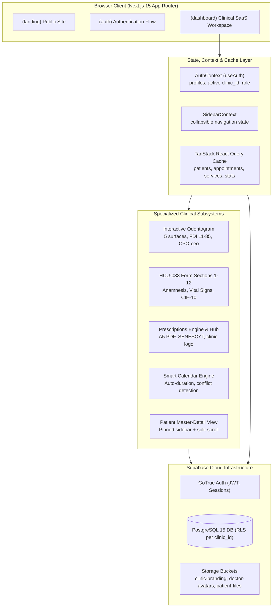
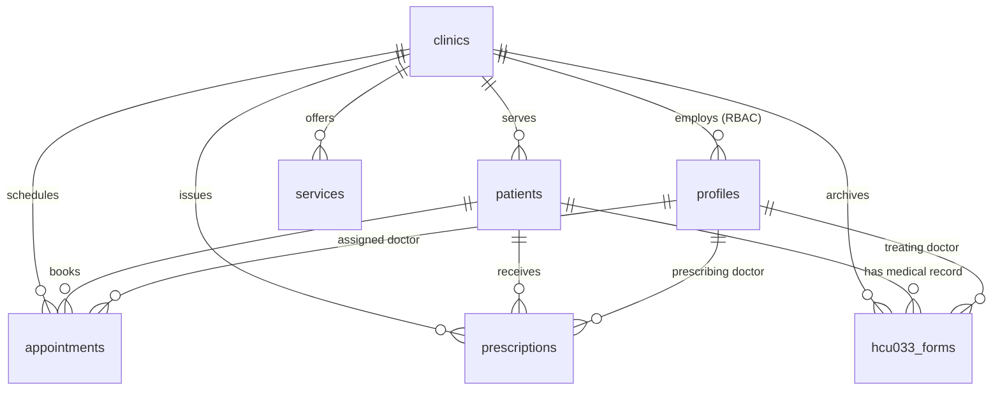

# CLINIA+ DENTAL SAAS — COMPLETE ARCHITECTURE MAP

> **File Purpose**: Master architectural index and component lookup map for AI Agents and Senior Developers.  
> **Repository**: `c:\Users\aleja\Documents\0-dev\denta-pro`  
> **Tech Stack**: Next.js 15 (App Router), TypeScript 5.x, Tailwind CSS, shadcn/ui, Supabase (PostgreSQL 15 + RLS + Storage), TanStack React Query, jsPDF.  
> **Clinical Regulations**: Ecuadorian MSP Formulario 033 (`SNS-MSP / HCU-form.033 / 2008`) & LOPDP Ecuador.

---

## 1. High-Level Architecture & Data Flow



---

## 2. Fast Component & Feature Lookup Index ("Where Do I Find X?")

When you need to inspect, modify, or debug any feature, consult this direct lookup table:

| Feature / Domain | Primary Entry Point | Key Subcomponents | Supporting Files & Utilities |
| :--- | :--- | :--- | :--- |
| **Interactive Odontogram** | [`components/odontograma-interactive.tsx`](file:///c:/Users/aleja/Documents/0-dev/denta-pro/components/odontograma-interactive.tsx) | [`components/odontogram-preview.tsx`](file:///c:/Users/aleja/Documents/0-dev/denta-pro/components/odontogram-preview.tsx)<br/>[`components/odontogram.tsx`](file:///c:/Users/aleja/Documents/0-dev/denta-pro/components/odontogram.tsx) | [`lib/constants.ts`](file:///c:/Users/aleja/Documents/0-dev/denta-pro/lib/constants.ts) (FDI tooth coordinates, teeth lists) |
| **Formulario HCU-033 (MSP)** | [`components/hcu033-form.tsx`](file:///c:/Users/aleja/Documents/0-dev/denta-pro/components/hcu033-form.tsx) | [`components/signature-pad.tsx`](file:///c:/Users/aleja/Documents/0-dev/denta-pro/components/signature-pad.tsx) (Digital signature)<br/>[`components/periodontogram.tsx`](file:///c:/Users/aleja/Documents/0-dev/denta-pro/components/periodontogram.tsx) | [`lib/pdf-generator.ts`](file:///c:/Users/aleja/Documents/0-dev/denta-pro/lib/pdf-generator.ts) (`generateHCU033`) |
| **Patient Profile & Charting** | [`app/(dashboard)/patients/[id]/page.tsx`](file:///c:/Users/aleja/Documents/0-dev/denta-pro/app/(dashboard)/patients/[id]/page.tsx) | [`components/patient-medical-records.tsx`](file:///c:/Users/aleja/Documents/0-dev/denta-pro/components/patient-medical-records.tsx)<br/>[`components/patient-files.tsx`](file:///c:/Users/aleja/Documents/0-dev/denta-pro/components/patient-files.tsx)<br/>[`components/family-center.tsx`](file:///c:/Users/aleja/Documents/0-dev/denta-pro/components/family-center.tsx) | [`lib/patient-utils.ts`](file:///c:/Users/aleja/Documents/0-dev/denta-pro/lib/patient-utils.ts) (cédula validation, formats) |
| **Chairside Rapid Booking** | [`components/quick-appointment-dialog.tsx`](file:///c:/Users/aleja/Documents/0-dev/denta-pro/components/quick-appointment-dialog.tsx) | Integrated in top bar of `patients/[id]` & `appointment-list.tsx` | [`lib/calendar-conflict.ts`](file:///c:/Users/aleja/Documents/0-dev/denta-pro/lib/calendar-conflict.ts) |
| **Prescriptions Hub (`/recipes`)** | [`app/(dashboard)/recipes/page.tsx`](file:///c:/Users/aleja/Documents/0-dev/denta-pro/app/(dashboard)/recipes/page.tsx) | [`components/issued-prescriptions-list.tsx`](file:///c:/Users/aleja/Documents/0-dev/denta-pro/components/issued-prescriptions-list.tsx)<br/>[`components/settings/recipes-tab.tsx`](file:///c:/Users/aleja/Documents/0-dev/denta-pro/components/settings/recipes-tab.tsx) | [`components/patient-prescriptions.tsx`](file:///c:/Users/aleja/Documents/0-dev/denta-pro/components/patient-prescriptions.tsx)<br/>[`lib/pdf-generator.ts`](file:///c:/Users/aleja/Documents/0-dev/denta-pro/lib/pdf-generator.ts) (`generatePrescription`) |
| **Smart Calendar & Scheduling** | [`app/(dashboard)/calendar/page.tsx`](file:///c:/Users/aleja/Documents/0-dev/denta-pro/app/(dashboard)/calendar/page.tsx) | [`components/calendar/modern-calendar.tsx`](file:///c:/Users/aleja/Documents/0-dev/denta-pro/components/calendar/modern-calendar.tsx)<br/>[`components/async-patient-select.tsx`](file:///c:/Users/aleja/Documents/0-dev/denta-pro/components/async-patient-select.tsx) | [`lib/calendar-conflict.ts`](file:///c:/Users/aleja/Documents/0-dev/denta-pro/lib/calendar-conflict.ts)<br/>[`lib/recall-service.ts`](file:///c:/Users/aleja/Documents/0-dev/denta-pro/lib/recall-service.ts) |
| **Clinical Dashboard KPIs** | [`app/(dashboard)/dashboard/page.tsx`](file:///c:/Users/aleja/Documents/0-dev/denta-pro/app/(dashboard)/dashboard/page.tsx) | [`components/dashboard.tsx`](file:///c:/Users/aleja/Documents/0-dev/denta-pro/components/dashboard.tsx)<br/>[`components/patient-visits-chart.tsx`](file:///c:/Users/aleja/Documents/0-dev/denta-pro/components/patient-visits-chart.tsx) | [`components/recall-widget.tsx`](file:///c:/Users/aleja/Documents/0-dev/denta-pro/components/recall-widget.tsx) |
| **Services & Treatments Catalog** | [`app/(dashboard)/dashboard/services/page.tsx`](file:///c:/Users/aleja/Documents/0-dev/denta-pro/app/(dashboard)/dashboard/services/page.tsx) | [`components/dashboard/services/services-manager.tsx`](file:///c:/Users/aleja/Documents/0-dev/denta-pro/components/dashboard/services/services-manager.tsx)<br/>[`components/settings/services-tab.tsx`](file:///c:/Users/aleja/Documents/0-dev/denta-pro/components/settings/services-tab.tsx) | Table: `services` |
| **Settings & LOPDP Portability** | [`app/(dashboard)/settings/page.tsx`](file:///c:/Users/aleja/Documents/0-dev/denta-pro/app/(dashboard)/settings/page.tsx) | [`components/settings/privacy-tab.tsx`](file:///c:/Users/aleja/Documents/0-dev/denta-pro/components/settings/privacy-tab.tsx)<br/>[`components/settings/clinic-tab.tsx`](file:///c:/Users/aleja/Documents/0-dev/denta-pro/components/settings/clinic-tab.tsx)<br/>[`components/settings/subscription-tab.tsx`](file:///c:/Users/aleja/Documents/0-dev/denta-pro/components/settings/subscription-tab.tsx) | LOPDP JSON Export, Audit Log View (`clinic_audit_logs`) |
| **Staff & RBAC Permissions** | [`app/(dashboard)/dentists/page.tsx`](file:///c:/Users/aleja/Documents/0-dev/denta-pro/app/(dashboard)/dentists/page.tsx) | [`components/user-nav.tsx`](file:///c:/Users/aleja/Documents/0-dev/denta-pro/components/user-nav.tsx)<br/>[`components/avatar-upload.tsx`](file:///c:/Users/aleja/Documents/0-dev/denta-pro/components/avatar-upload.tsx) | [`app/actions/invite-member.ts`](file:///c:/Users/aleja/Documents/0-dev/denta-pro/app/actions/invite-member.ts) |
| **Patient Directory & EHR Export** | [`app/(dashboard)/patients/page.tsx`](file:///c:/Users/aleja/Documents/0-dev/denta-pro/app/(dashboard)/patients/page.tsx) | [`components/add-patient-form.tsx`](file:///c:/Users/aleja/Documents/0-dev/denta-pro/components/add-patient-form.tsx) (with LOPDP consent) | Excel CSV export with `\uFEFF` UTF-8 BOM & `;` delimiter |
| **Analytics & Clinical Reports** | [`app/(dashboard)/reports/page.tsx`](file:///c:/Users/aleja/Documents/0-dev/denta-pro/app/(dashboard)/reports/page.tsx) | Recharts components (status breakdown, top treatments) | [`lib/reports-pdf.ts`](file:///c:/Users/aleja/Documents/0-dev/denta-pro/lib/reports-pdf.ts) (Branded analytics PDF export) |

---

## 3. Directory Structure Map

```text
denta-pro/
├── app/                                # Next.js 15 App Router
│   ├── (auth)/                         # Authentication route group
│   │   ├── login/                      # Login page (login-form.tsx)
│   │   ├── signup/                     # Registration & clinic provisioning
│   │   ├── forgot-password/            # Password recovery request
│   │   └── update-password/            # Secure password reset
│   ├── (dashboard)/                    # Protected multi-tenant SaaS workspace
│   │   ├── layout.tsx                  # Pinned sidebar, auth-guard, header
│   │   ├── dashboard/                  # Operations center & recent patients
│   │   │   └── services/               # Clinical services catalog management
│   │   ├── patients/                   # Patient directory, Excel EHR export
│   │   │   └── [id]/                   # Master-detail split clinical chart
│   │   ├── calendar/                   # Smart scheduling & appointment modal
│   │   ├── recipes/                    # Dual-tab prescriptions hub (history + templates)
│   │   ├── reports/                    # Clinical & booking analytics suite
│   │   ├── dentists/                   # Team management, roles & SENESCYT licenses
│   │   ├── clinic/                     # Clinic corporate details & schedule
│   │   ├── settings/                   # Multi-tab settings (Privacy/LOPDP, Clinic, etc.)
│   │   ├── billing/                    # Staged billing module (de-emphasized for MVP)
│   │   ├── marketing/                  # Loyalty marketing & campaign module
│   │   └── messages/                   # Internal clinic notifications & SMS/email
│   ├── (landing)/                      # Public marketing pages & schedule-demo
│   ├── actions/                        # Next.js Server Actions
│   │   ├── invite-member.ts            # RBAC invitation dispatcher
│   │   ├── register-clinic.ts          # Tenant creation & provisioning
│   │   └── settings.ts                 # Clinic configuration mutations
│   └── api/                            # Backend API routes
│       ├── auth/confirm/               # Supabase auth email confirmation
│       ├── payments/subscribe/         # Subscription processing endpoint
│       ├── send-email/                 # Resend transactional email integration
│       └── webhooks/kushki/            # Payment gateway webhook handler
├── components/                         # React UI & Business Logic Components
│   ├── ui/                             # 25+ shadcn/ui primitives (Radix UI based)
│   ├── calendar/                       # modern-calendar.tsx
│   ├── dashboard/services/             # services-manager.tsx
│   ├── settings/                       # Tabbed settings (privacy, clinic, subscription, recipes)
│   ├── billing/                        # Invoice and payment dialogs
│   ├── appointment-timeline/           # Clinical timeline component
│   ├── auth-context.tsx                # useAuth hook: user, profile, active clinic_id
│   ├── sidebar.tsx                     # Collapsible clinical navigation
│   ├── hcu033-form.tsx                 # Official Ecuadorian MSP Formulario 033
│   ├── odontograma-interactive.tsx     # 5-surface vector odontogram + CPO/ceo
│   ├── quick-appointment-dialog.tsx   # Chairside 1-click appointment booking
│   ├── patient-prescriptions.tsx       # Patient chart prescription tab
│   ├── issued-prescriptions-list.tsx   # Clinic-wide prescription audit & re-print
│   ├── add-patient-form.tsx            # Patient intake form + statutory LOPDP consent
│   └── signature-pad.tsx               # HTML5 Canvas digital signature pad
├── lib/                                # Utilities, SDKs, and Pure Logic
│   ├── supabase.ts                     # Supabase client instances (browser + server)
│   ├── pdf-generator.ts                # jsPDF engine: Formulario 033 & Recetas Médicas A5
│   ├── reports-pdf.ts                  # jsPDF engine: Analytics & KPIs summary report
│   ├── calendar-conflict.ts            # Appointment overlap & duration validation
│   ├── recall-service.ts               # Preventative dental recall engine
│   ├── patient-utils.ts                # Ecuadorian Cédula check-digit algorithm
│   ├── subscription-plans.ts           # Tier definitions: Trial, Start, Pro, Enterprise
│   └── constants.ts                    # Tooth geometry, FDI numbers, system constants
├── supabase/                           # Database Schema & Migrations
│   ├── migrations/                     # 35+ SQL migrations (tables, RLS, indexes)
│   └── functions/                      # Deno Edge Functions (send-reminders, purge, invite)
└── .agents/                            # Antigravity Rules & Skills
    ├── rules/                          # Invariants (clinical-saas-invariants.md, etc.)
    └── skills/                         # dental-clinical-standards skill definition
```

---

## 4. Key Subsystem Architectures

### 4.1 Master-Detail Patient Split Layout (`app/(dashboard)/patients/[id]/page.tsx`)

To avoid losing patient identity while scrolling through long clinical records, the desktop view enforces a split viewport:

```text
+----------------------------------------------------------------------------------------+
| Patient Profile Top Bar: [Status Badge] [Nacionalidad]   [Editar Info] [Agendar Cita]  |
+-----------------------------+----------------------------------------------------------+
| PINNED LEFT SIDEBAR (Fixed) | INDEPENDENT RIGHT TABS (Scrollable: custom-scrollbar)    |
|                             | [Odontograma] [HCU-033] [Recetas] [Citas] [Familia]      |
| • Avatar & Full Name        |                                                          |
| • Cédula & Age              |                                                          |
| • Emergency Contact         | Active Tab Content:                                      |
| • Medical Alerts:           | • Interactive FDI tooth arches                           |
|   - Diabetes (Yes/No)       | • 12 MSP sections with auto CPO-ceo                      |
|   - Hypertension (Yes/No)   | • Prescriptions history & A5 PDF generator               |
|   - Allergies & Notes       | • Appointments list with status badges                   |
| • Account Balance ($)       |                                                          |
+-----------------------------+----------------------------------------------------------+
```

### 4.2 Interactive Odontogram Architecture (`components/odontograma-interactive.tsx`)

- **State Model**: Keyed by 2-digit FDI string (`"18"` to `"85"`):
  ```typescript
  interface ToothState {
    surfaces: {
      top?: SurfaceCondition;      // Vestibular / Palatino
      bottom?: SurfaceCondition;   // Lingual / Vestibular
      left?: SurfaceCondition;     // Mesial / Distal
      right?: SurfaceCondition;    // Distal / Mesial
      center?: SurfaceCondition;   // Oclusal / Incisal
    };
    general?: ToothCondition;      // Extracción, Ausente, Corona, Endodoncia
    notes?: string;
  }
  ```
- **Dual Mode**:
  - `red`: Existing pathology (requires restorative intervention).
  - `blue`: Performed / existing healthy restoration.
- **Auto CPO-ceo Calculation**: Derived in real-time from `teethState` without waiting for save.
- **Safety**: `history` stack of 15 states with `handleUndo` (`RotateCcw`), plus a confirmation modal on `handleClearAll`.

### 4.3 Prescriptions Architecture (`components/patient-prescriptions.tsx` & `lib/pdf-generator.ts`)

- **Storage Integration**: Automatically resolves the public URL of the clinic logo from the `clinic-branding` bucket.
- **Doctor Credentials**: Joins `profiles` to pull `full_name`, `specialization`, and `license_number` (SENESCYT / MSP).
- **Format**: Generates standard A5 medical prescription PDF matching Latin American pharmacological conventions.

---

## 5. Database Schema & Multi-Tenant Mapping

Every tenant query in Clinia+ relies on `clinic_id`. Here are the primary tables:



### Table Definitions & Column Traps

| Table | Critical Columns | Common Developer/Agent Pitfalls |
| :--- | :--- | :--- |
| `patients` | `id, clinic_id, first_name, last_name, cedula, birth_date, allergies, medical_conditions, has_diabetes, has_hypertension, has_heart_disease, data_consent, account_balance` | ⚠️ Identification column is `cedula` (NOT `document_id`). Demographic consent is `data_consent`. |
| `profiles` | `id, clinic_id, full_name, email, role, specialization, license_number, avatar_url` | ⚠️ Specialty column is `specialization` (NOT `specialty`). License column is `license_number`. Roles: `clinic_owner`, `admin`, `doctor`, `receptionist`. |
| `prescriptions`| `id, clinic_id, patient_id, doctor_id, created_at, data` | ⚠️ Must ALWAYS include `clinic_id` on insert! `data` is a JSONB containing `medications` array and `indications`. |
| `hcu033_forms` | `id, clinic_id, patient_id, doctor_id, form_data, created_at, updated_at` | ⚠️ Contains all 12 MSP sections and odontogram polygon data inside `form_data` (JSONB). |
| `appointments` | `id, clinic_id, patient_id, doctor_id, start_time, end_time, status, service_id, notes` | ⚠️ Statuses: `scheduled`, `confirmed`, `completed`, `cancelled`, `no_show`. |
| `services` | `id, clinic_id, name, description, price, duration_minutes, active, category` | ⚠️ Duration is stored as `duration_minutes` (default: 30) for automatic calendar slot calculations. |

---

## 6. Runtime Invariants & Platform Best Practices

When writing code or queries in Clinia+, you MUST respect these invariants:

1. **Multi-Tenant Isolation**: Never execute a query without `.eq('clinic_id', currentClinicId)`.
2. **Windows Node.js IPv6 Timeout**: Standalone Node scripts or background tests connecting to `*.supabase.co` on Windows must set:
   ```javascript
   const dns = require('node:dns');
   dns.setDefaultResultOrder('ipv4first');
   ```
3. **Spanish Excel CSV Export**: When downloading patient CSVs for Excel on Windows, always prepend `\uFEFF` (UTF-8 BOM) and use `;` (semicolon) as the column delimiter:
   ```typescript
   const csv = "\uFEFF" + rows.map(r => r.join(";")).join("\r\n");
   ```
4. **Statutory Medical Record Custody**: Never implement a naive hard-delete for patients or clinical forms. Under Ecuadorian health law, records must be archived for a mandatory 5-to-10-year period.
5. **Deterministic Type Check**: Always run `npx tsc --noEmit` before marking tasks complete.
