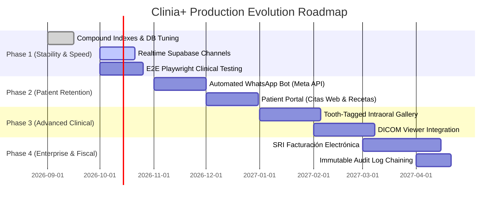

# CLINIA+ DENTAL SAAS — CORRECTIONS, TECHNICAL DEBT & IMPLEMENTATION ROADMAP

> **Document Version**: 1.0  
> **Evaluation Framework**: Production-Grade Dental Practice Management (PMS) & Electronic Health Record (EHR) Standards  
> **Benchmark Systems**: Dentrix Ascend, Curve Dental, Dentally, Dentalink, Carestream Dental

---

## 1. Executive Summary & Evaluation Scorecard

Clinia+ has achieved a strong foundation with its **Ecuadorian MSP Formulario 033**, **FDI interactive odontogram**, **A5 prescription engine**, and **LOPDP data portability**. However, to reach enterprise-grade maturity and compete with international PMS platforms, key technical corrections, performance optimizations, and clinical enhancements are required.

### Industry Benchmark Matrix

| Dimension | Current Clinia+ State | Industry Production Standard | Priority |
| :--- | :--- | :--- | :---: |
| **Chairside Real-Time Sync** | Polling via React Query refetch | Real-time WebSocket subscriptions via Supabase Channels | **P0 (High)** |
| **Database Indexing** | Default PK & basic FK indexes | Compound multi-tenant indexes (`clinic_id, cedula`, `clinic_id, start_time`) | **P0 (High)** |
| **Automated Patient Comms** | Manual WhatsApp click-to-chat links | Two-way automated WhatsApp reminders via Meta Cloud API / Twilio | **P1 (High)** |
| **Dental Imaging & DICOM** | Standard image upload | Intraoral image gallery tagged by tooth number + DICOM viewer | **P1 (Medium)** |
| **Electronic Invoicing (SRI)** | Financial billing hidden for MVP | SRI Facturación Electrónica (RUC, XML firmado XAdES-BES) | **P2 (Medium)** |
| **Offline Resilience / PWA** | Web-only, requires constant internet | Service Worker cache for chairside charting during connectivity drops | **P2 (Medium)** |
| **Audit Log Tamper-Resistance**| Standard database log table | Cryptographically chained / immutable audit log for legal defense | **P2 (Low)** |

---

## 2. Identified Technical Corrections & Gaps

### 2.1 Database & Concurrency Optimizations

#### Issue 1: Missing Compound Multi-Tenant Indexes
Currently, queries frequently filter by `clinic_id` combined with other columns (e.g., `WHERE clinic_id = X AND cedula = Y` or `WHERE clinic_id = X AND start_time >= Y`). Without compound indexes, PostgreSQL performs sequential scans across large tenant tables.

**Recommended Correction:**
```sql
-- Migration: Add critical multi-tenant indexes
CREATE INDEX IF NOT EXISTS idx_patients_clinic_cedula 
  ON patients (clinic_id, cedula);

CREATE INDEX IF NOT EXISTS idx_appointments_clinic_start 
  ON appointments (clinic_id, start_time);

CREATE INDEX IF NOT EXISTS idx_appointments_patient_doctor 
  ON appointments (clinic_id, patient_id, doctor_id);

CREATE INDEX IF NOT EXISTS idx_prescriptions_clinic_created 
  ON prescriptions (clinic_id, created_at DESC);

CREATE INDEX IF NOT EXISTS idx_hcu033_clinic_patient 
  ON hcu033_forms (clinic_id, patient_id);
```

#### Issue 2: Real-Time Calendar Collisions
If Receptionist A books an appointment for Doctor X at 10:00 AM while Receptionist B is viewing the calendar, B's screen does not update until a page reload or query refetch, allowing double-booking collisions.

**Recommended Correction:**
Enable Supabase Realtime Channels on the `appointments` table:
```typescript
// Subscribe to appointment changes in modern-calendar.tsx
useEffect(() => {
  if (!currentClinicId) return;

  const channel = supabase
    .channel(`appointments-clinic-${currentClinicId}`)
    .on(
      'postgres_changes',
      {
        event: '*',
        schema: 'public',
        table: 'appointments',
        filter: `clinic_id=eq.${currentClinicId}`
      },
      (payload) => {
        // Invalidate React Query cache immediately
        queryClient.invalidateQueries({ queryKey: ['appointments', currentClinicId] });
      }
    )
    .subscribe();

  return () => {
    supabase.removeChannel(channel);
  };
}, [currentClinicId, queryClient]);
```

---

### 2.2 Clinical & Operational Corrections

#### Issue 3: Dental Arch Scaling on Small Displays
On laptops with 13-inch screens (1366x768 or 1280x800), the adult and deciduous dental arches in `odontograma-interactive.tsx` can feel tight horizontally if the left sidebar is expanded.

**Recommended Correction:**
- Wrap the odontogram canvas in an auto-scaling SVG viewport or CSS `transform: scale()` container with zoom controls (`+`, `-`, `100%`).
- Provide an icon to toggle the left sidebar into a collapsed mini-bar (`w-16`) during intensive charting sessions.

#### Issue 4: Prescription Template Scope
Currently, `prescription_templates` are scoped by `doctor_id`. In a multi-doctor clinic, doctors often want to share common clinic-wide templates (e.g., standard post-extraction kit).

**Recommended Correction:**
Add `clinic_id` and `is_shared` (boolean) to `prescription_templates`:
```sql
ALTER TABLE prescription_templates 
ADD COLUMN IF NOT EXISTS clinic_id UUID REFERENCES clinics(id),
ADD COLUMN IF NOT EXISTS is_shared BOOLEAN DEFAULT false;
```
Allow doctors to view both their personal templates and clinic-wide shared templates.

---

## 3. High-Value Implementation Roadmap



---

### Phase 1: Stability, Concurrency & Automated Testing
1. **Supabase Realtime WebSockets**: Synchronize appointments, patient status, and waiting room queue live across all clinic computers.
2. **Automated E2E Clinical Test Suite**:
   - Write Playwright tests simulating:
     - Receptionist registers patient with Cédula and LOPDP consent.
     - Receptionist schedules appointment with Doctor A.
     - Doctor opens patient chart, charts 3 teeth in Odontogram, fills Section 4 of HCU-033, and saves.
     - Doctor generates prescription with Amoxicilina 500mg, verifies SENESCYT license, and downloads PDF.
     - Receptionist marks appointment as Completed.

### Phase 2: Patient Retention & WhatsApp Automation
1. **Two-Way WhatsApp Reminders (Meta Cloud API / Twilio)**:
   - 24 hours before appointment: send automated message:
     *"Hola [Nombre], confirmamos su cita dental mañana a las [Hora] con el Dr. [Doctor] en [Clínica]. Responda 1 para CONFIRMAR o 2 para REPROGRAMAR."*
   - Incoming webhook automatically updates appointment status to `confirmed` or flags for rescheduling.
2. **Patient Self-Service Web Portal**:
   - Patients receive a magic link to view their upcoming appointments, post-treatment care instructions, and download their issued prescriptions in PDF without calling the clinic.

### Phase 3: Advanced Dental Imaging (PACS & DICOM)
1. **Intraoral Image Gallery Tagged by Tooth**:
   - Dental records require before/after photography. Allow uploading photos tagged to specific FDI tooth numbers (e.g., Tooth 21 - Carilla de Porcelana).
2. **DICOM / Panorámica Web Viewer**:
   - Lightweight Cornerstone.js or OpenJPEG web viewer for Panoramic X-Rays and Periapical radiographs with contrast/brightness adjustments and measurement rulers.

### Phase 4: Fiscal Compliance & Enterprise Readiness
1. **SRI Facturación Electrónica (Ecuador)**:
   - When the clinic is ready to restore financial billing, connect directly to the SRI web services:
     - Generate XML signed with electronic signature (`.p12`).
     - Transmit to SRI WS (Recepción y Autorización).
     - Store 49-digit *Clave de Acceso* and generate RIDE PDF with barcode.
2. **Tamper-Resistant Audit Trail**:
   - Implement hash chaining (each log entry contains `hash = SHA256(prev_hash + entry_data)`), ensuring complete medico-legal integrity in the event of malpractice disputes.
