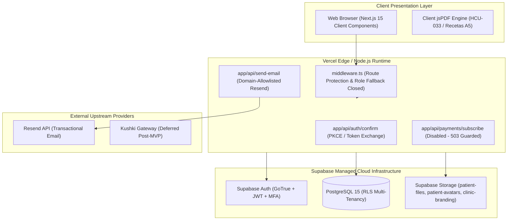

# CLINIA+ DENTAL EHR/PMS — PRODUCTION OPERATIONAL RUNBOOK

> **Document Version**: 1.0.0  
> **Release Target**: Production Milestone 7 (M7)  
> **Classification**: Restricted — Internal Clinical SaaS Operations & DevOps  
> **Regulatory Baseline**: Ecuador LOPDP (Ley Orgánica de Protección de Datos Personales), MSP HCU-033, Ley Orgánica de Salud Art. 7  
> **Target Service Level**: Availability ≥ 99.9%, RPO < 24 Hours, RTO < 1 Hour  

---

## 1. System Architecture & Component Topology

Clinia+ is a cloud-native, multi-tenant Dental Practice Management (PMS) and Electronic Health Record (EHR) platform.



### 1.1 Key Infrastructure Components
- **Hosting & Compute**: Vercel Serverless / Node.js 18+ runtime (Next.js 15 App Router).
- **Database & Auth**: Supabase PostgreSQL 15 with native Row-Level Security (RLS), GoTrue Authentication with custom access token hook.
- **Object Storage**: Supabase Storage with private buckets (`patient-files`, `patient-avatars`, `receipts`) accessed strictly via time-limited signed URLs (TTL: 3600s), and public bucket (`clinic-branding`).
- **Email Ingress**: Resend REST API protected by domain destination allowlisting and request payload limits.
- **Billing / Payments**: Kushki Gateway — **Out of Scope for M7 MVP** (endpoint `/api/payments/subscribe` fails closed with HTTP 503).

---

## 2. Staging Deployment & Migration Execution SOP

Before applying any schema changes or code deployments to production, all changes MUST be executed and verified in an isolated staging environment.

### 2.1 Pre-Deployment Verification Checklist
1. **Working Tree Cleanliness**: Verify that all modified application files and test suites are checked into version control.
2. **Deterministic Build Verification**:
   ```powershell
   npx tsc --noEmit
   npm run lint
   npm test
   npm run build
   ```
3. **Dependency Vulnerability Verification**:
   ```powershell
   npm audit --omit=dev
   ```
   *Requirement*: Exactly 0 vulnerabilities.

### 2.2 Database Migration Execution (`20260922194927`)
Migration `20260922194927_enforce_clinical_tenant_links_and_rights_audit.sql` introduces composite foreign keys `(clinic_id, patient_id)` across 10 child tables to eliminate cross-tenant data dangling, narrows clinical RLS policies to enforce least-privilege, and hardens the LOPDP audit trail.

#### Step 1: Pre-Flight Integrity Probe
Execute the following diagnostic query in staging/production PostgreSQL to confirm zero orphaned rows or cross-tenant mismatches exist before altering constraints:
```sql
SELECT 'appointments' AS tbl, count(*) FROM appointments a JOIN patients p ON a.patient_id = p.id WHERE a.clinic_id != p.clinic_id
UNION ALL
SELECT 'prescriptions', count(*) FROM prescriptions r JOIN patients p ON r.patient_id = p.id WHERE r.clinic_id != p.clinic_id
UNION ALL
SELECT 'clinical_records', count(*) FROM clinical_records c JOIN patients p ON c.patient_id = p.id WHERE c.clinic_id != p.clinic_id
UNION ALL
SELECT 'patient_notes', count(*) FROM patient_notes n JOIN patients p ON n.patient_id = p.id WHERE n.clinic_id != p.clinic_id
UNION ALL
SELECT 'patient_files', count(*) FROM patient_files f JOIN patients p ON f.patient_id = p.id WHERE f.clinic_id != p.clinic_id
UNION ALL
SELECT 'hcu033_forms', count(*) FROM hcu033_forms h JOIN patients p ON h.patient_id = p.id WHERE h.clinic_id != p.clinic_id
UNION ALL
SELECT 'data_rights_requests', count(*) FROM data_rights_requests d JOIN patients p ON d.patient_id = p.id WHERE d.clinic_id != p.clinic_id
UNION ALL
SELECT 'billings', count(*) FROM billings b JOIN patients p ON b.patient_id = p.id WHERE b.clinic_id != p.clinic_id
UNION ALL
SELECT 'invoices', count(*) FROM invoices i JOIN patients p ON i.patient_id = p.id WHERE i.clinic_id != p.clinic_id;
```
*Requirement*: All count results MUST return `0`. If any count > 0, halt deployment immediately and remediate orphaned records.

#### Step 2: Apply Migration
Apply the migration inside an explicit transaction:
```bash
# Using Supabase CLI (Staging Linked Project)
supabase db push

# OR Using psql with direct connection
psql "$STAGING_DATABASE_URL" -v ON_ERROR_STOP=1 -f supabase/migrations/20260922194927_enforce_clinical_tenant_links_and_rights_audit.sql
```

#### Step 3: Post-Migration Validation
Verify that all 10 composite foreign keys are active:
```sql
SELECT conname, conrelid::regclass, confrelid::regclass 
FROM pg_constraint 
WHERE conname LIKE '%composite_patient_clinic_fk%' 
   OR conname LIKE '%appointments_patient_clinic_fk%';
```
*Requirement*: Exactly 10 composite constraints must be present.

---

## 3. Emergency Rollback Procedure

If migration execution encounters unrecoverable locking timeouts, syntax errors, or application regressions post-deployment, the backward migration script must be executed immediately.

### 3.1 Rollback Trigger Conditions
- DDL execution failure or timeout during `supabase db push`.
- Application error rate (5xx responses) exceeds 1% in the 15 minutes post-deployment.
- Broken foreign key cascade behavior during patient deletion.
- Deadlocks detected on `patients` or `appointments` table under normal load.

### 3.2 Rollback Execution Steps
1. **Notify Incident Commander**: Announce maintenance rollback window in operational communication channel.
2. **Execute Backward Migration Script**:
   ```bash
   psql "$TARGET_DATABASE_URL" -v ON_ERROR_STOP=1 -f supabase/migrations/rollback_20260922194927.sql
   ```
3. **Verify Restored Constraints**:
   Execute the verification query to confirm legacy single-column FKs are restored:
   ```sql
   SELECT conname, conrelid::regclass 
   FROM pg_constraint 
   WHERE conrelid::regclass::text IN ('appointments', 'prescriptions', 'clinical_records', 'patient_files', 'hcu033_forms')
     AND contype = 'f';
   ```
4. **Rollback Vercel Deployment**:
   If the rollback requires application code reversion:
   - In Vercel Dashboard: Select Project > Deployments > Locate previous stable deployment > Click **Instant Rollback**.
   - Or via CLI: `vercel rollback <DEPLOYMENT_ID>`.

---

## 4. Clinic Onboarding & Administrative Operations SOP

### 4.1 New Clinic Registration
1. **Owner Account Creation**:
   - The prospective clinic owner signs up via the registration portal (`/register`).
   - Email verification is enforced: user must verify via the magic link / PKCE confirmation endpoint (`/api/auth/confirm`).
2. **Clinic Profile Setup**:
   - Clinic legal name and commercial name.
   - Ecuadorian Tax Identification (RUC): Must be validated as a 13-digit string ending in `001`.
   - Clinic address, phone number, and official timezone (`America/Guayaquil`).
   - Default clinical services seeded automatically via `seed_default_services` function upon clinic creation.

### 4.2 Staff Provisioning & Role Management
Clinia+ enforces three distinct roles via Role-Based Access Control (RBAC):

| Role | Permitted Workflows | Clinical Restrictions |
| :--- | :--- | :--- |
| `clinic_owner` | Full clinic administration, staff invite/removal, billing, audit logs, full clinical charting | No clinical restrictions |
| `doctor` | Patient medical records, HCU-033 forms, FDI odontograms, digital prescriptions, patient files | Cannot invite/remove staff or export full clinic backups |
| `receptionist` | Patient intake (demographics), appointment scheduling, billing records | **STRICTLY BLOCKED** from viewing or editing diagnostic notes, HCU-033 forms, odontograms, or prescriptions |

#### Staff Invitation Procedure:
1. Clinic Owner navigates to **Configuración > Equipo** (`/settings?tab=team`).
2. Inputs staff member email, full name, assigned role (`doctor` or `receptionist`), and professional license number (SENESCYT / MSP registration) for doctors.
3. System issues transactional invitation email with cryptographic token.
4. **Security Invariant**: Invitation authorization verifies that the inviter is a verified clinic owner in `clinics.owner_id` or `clinic_members`. Arbitrary `profiles.role` claims are rejected.

### 4.3 Staff Offboarding & Immediate Session Cutoff
When a doctor or receptionist leaves the clinic:
1. Clinic Owner navigates to **Configuración > Equipo** and selects **Eliminar Miembro**.
2. Database removes member from `clinic_members`.
3. **Supabase Custom Access Token Hook** triggers on next token refresh, removing `clinic_id` and `role` claims from JWT.
4. **Live RLS Verification**: Clinical table policies evaluate `public.is_clinic_member(clinic_id)`, terminating access **immediately**, even if the client holds an unexpired JWT token.

### 4.4 Clinic Purge & Retention Protection Invariant
Under Ecuadorian Ley Orgánica de Salud (Art. 7) and MSP technical norms, medical records (HCU-033, clinical notes, prescriptions) must be preserved for a statutory custody period (5–10 years).
- **Safety Invariant**: The database maintenance function `public.purge_clinic_data(clinic_id)` has been modified to fail closed. It will refuse execution with an exception if any active patients, clinical records, or audit rows exist for the clinic.
- Hard deletion of clinics with active medical records cannot be performed through the application UI or standard client APIs.

---

## 5. Disaster Recovery & Backup/Restore Drill Protocol

### 5.1 Service Level Objectives (SLOs)
- **Recovery Point Objective (RPO)**: < 24 Hours (Maximum allowable data loss).
- **Recovery Time Objective (RTO)**: < 1 Hour (Maximum allowable downtime).

### 5.2 Backup Regimes
1. **PostgreSQL Database Backups**:
   - Automated Daily Backups provided by Supabase Enterprise infrastructure with Point-in-Time Recovery (PITR) enabled.
   - Physical backups taken daily with continuous Write-Ahead Log (WAL) archiving.
2. **Storage Object Backups**:
   - Supabase Storage buckets (`patient-files`, `patient-avatars`, `receipts`, `clinic-branding`) replicated across redundant regional storage.
   - Nightly metadata snapshot of `storage.objects` table.

### 5.3 Point-in-Time Recovery (PITR) Execution Drill
This drill must be executed on a dedicated scratch project every six months:

```bash
# 1. Identify Target Timestamp (UTC)
RESTORE_TIMESTAMP="2026-09-22T19:49:00Z"

# 2. In Supabase Dashboard:
# Navigate to: Project Settings > Database > Backups > Point in Time Recovery
# Select: "Restore to a new project"
# Specify: Timestamp and new scratch project name: "clinia-restore-drill-YYYYMMDD"

# 3. Verify Database Integrity in Scratch Project:
psql "$SCRATCH_DB_URL" -c "SELECT count(*) FROM patients;"
psql "$SCRATCH_DB_URL" -c "SELECT count(*) FROM clinical_records;"
psql "$SCRATCH_DB_URL" -c "SELECT count(*) FROM hcu033_forms;"

# 4. Storage Re-link:
# Synchronize storage assets from target backup timestamp to scratch bucket.
```

### 5.4 Drill Documentation Requirements
Each restore drill must be logged with:
- Drill execution date and operator ID.
- Exact time elapsed from initiation to full service verification (must be < 60 min).
- Row count comparisons between source and restored database.
- Formal sign-off by Lead DevOps / Security Engineer.

---

## 6. Incident Response & PII/PHI Breach Escalation SOP

### 6.1 Severity Classification Matrix

| Level | Definition | Response SLA | Escalation Path |
| :--- | :--- | :--- | :--- |
| **SEV-0** | Active unauthorized exfiltration of patient health records (PHI), mass data corruption, or total platform outage | < 15 Minutes | Incident Commander, Lead Architect, Legal Counsel, Executive Board |
| **SEV-1** | Multi-tenant isolation failure (one clinic viewing another clinic's data), or critical authentication bypass | < 30 Minutes | Incident Commander, Lead Backend Engineer, Security Lead |
| **SEV-2** | Single-user privilege escalation, clinical record save failure, or email dispatch failure | < 2 Hours | DevOps On-Call, Engineering Team |
| **SEV-3** | Minor UI bug, non-clinical cosmetic defect, or non-blocking export delay | < 24 Hours | Product Engineering Backlog |

### 6.2 Data Breach Response Protocol (Ecuador LOPDP Art. 48)
If unauthorized access, exfiltration, or loss of Personal Identifiable Information (PII) or Protected Health Information (PHI) is confirmed:

1. **Immediate Containment (0–1 Hour)**:
   - Revoke compromised API keys (`SUPABASE_SERVICE_ROLE_KEY`, `RESEND_API_KEY`) immediately in provider consoles.
   - If user account compromised: disable account via Supabase Auth admin console (`auth.users.banned = true`).
   - If infrastructure breach suspected: place Next.js application in maintenance mode.
2. **Forensic Analysis & Audit Log Inspection (1–12 Hours)**:
   - Inspect PostgreSQL query logs and `data_rights_requests_audit` table.
   - Determine exact scope: affected clinics, patient cédulas, and records accessed.
3. **Statutory Regulatory Notification (Within 72 Hours)**:
   - Pursuant to **Article 48 of the Ley Orgánica de Protección de Datos Personales (LOPDP)**, Clinia+ and the affected Clinic Controller must notify the **Superintendencia de Protección de Datos Personales (SPDP)** within 72 hours of becoming aware of the breach.
   - The notification must detail:
     - Nature and categories of data subjects and records compromised.
     - Likely consequences and risks to patient privacy.
     - Technical and organizational measures implemented to mitigate the breach.
4. **Data Subject Notification**:
   - Coordinate with Clinic Owner (Data Controller) to notify affected patients in clear, simple language if the breach poses a high risk to their fundamental rights.

---

## 7. Emergency Contacts & Escalation Directory

| Role | Title | Contact Channel | Primary Responsibility |
| :--- | :--- | :--- | :--- |
| **Incident Commander** | Lead Systems Architect | `pager-ic@clinia.ec` / On-Call Pager | Incident coordination, executive communication |
| **Security Officer** | Data Protection Officer (DPD) | `dpo@clinia.ec` | LOPDP compliance, SPDP regulatory reporting |
| **Database Administrator** | Senior Database Engineer | `dba-oncall@clinia.ec` | PITR recovery, migration rollback, catalog integrity |
| **Legal Counsel** | Ecuadorian Healthcare Legal Specialist | `legal@clinia.ec` | Medical custody & statutory breach reporting sign-off |
