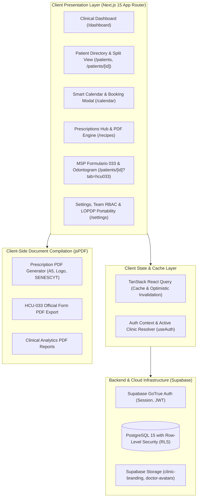
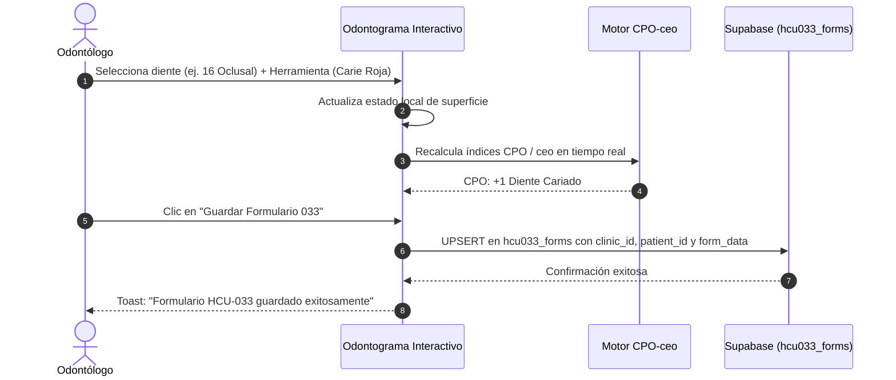

# CLINIA+ DENTAL SAAS — SYSTEM ARCHITECTURE & OPERATIONS MANUAL

> **Document Version**: 3.0  
> **Classification**: Production Standard — Clinical Electronic Health Record (EHR) & Practice Management SaaS (PMS)  
> **Normative Framework**: SNS-MSP / HCU-form.033 / 2008 (Ecuador) & Ley Orgánica de Protección de Datos Personales (LOPDP Ecuador)  
> **Tech Stack**: Next.js 15 (App Router), TypeScript 5.x, Tailwind CSS, shadcn/ui, Supabase PostgreSQL (RLS), TanStack Query, jsPDF.

---

## 1. Executive Summary & System Purpose

**Clinia+** is a multi-tenant Dental Practice Management (PMS) and Electronic Health Record (EHR) SaaS platform engineered specifically for dental clinics, polyclinics, and independent dental practitioners in Ecuador and Latin America.

The platform solves four critical challenges in modern dental practice:
1. **Regulatory Compliance (MSP HCU-033)**: Fully digitized Ecuadorian Ministry of Public Health Formulario 033 with automated FDI odontogram charting, CPO-ceo indices, and legal informed consent.
2. **Clinical Chairside Efficiency**: Sub-second patient lookups, rapid appointment scheduling directly from the patient chart, and pre-filled prescription generation with SENESCYT credentials.
3. **Data Protection & Legal Custody (LOPDP)**: Robust multi-tenant isolation (`clinic_id`), statutory informed consent capture, full audit trails, and 1-click structured data portability (Art. 17 LOPDP).
4. **Front-Desk & Clinical Workflow Alignment**: Role-based access control (RBAC) separating administrative/reception tasks from clinical procedures and doctor credentials.

---

## 2. High-Level Architecture Decomposition



---

## 3. Core Modules & Operational Workflows

### 3.1 Patient Management & Master-Detail Split View (`/patients/[id]`)

- **Design Pattern**: Master-Detail Split Viewport.
  - **Left Sidebar (Pinned)**: Fixed scroll container displaying patient avatar, cédula, age, emergency contact, chronic illness alerts (Diabetes, Hipertensión, Cardiopatías, Alergias), account balance, and the primary **"Editar Información Principal"** button.
  - **Right Content Pane (Independent Scroll)**: Houses the operational tabs:
    1. *Formulario 033 (HCU)*: Complete MSP medical record.
    2. *Odontograma*: 5-surface interactive dental chart.
    3. *Prescripciones*: Patient-specific medication history and PDF generator.
    4. *Citas*: Historical and upcoming visits with chairside booking.
    5. *Familia*: Relationship tree linking dependents to family heads.
- **Chairside Rapid Booking (`QuickAppointmentDialog`)**: Practitioners can schedule the next appointment directly from the patient header without navigating away to the main calendar.

### 3.2 Ecuadorian MSP Formulario 033 & Interactive Odontogram

- **Normative Reference**: SNS-MSP / HCU-form.033 / 2008.
- **FDI 2-Digit Tooth Numbering**:
  - Quadrants 1-4 (Teeth 11–48): Permanent dentition.
  - Quadrants 5-8 (Teeth 51–85): Deciduous (primary) dentition.
- **5-Surface Geometry**: Vestibular, Oclusal/Incisal, Mesial, Distal, Lingual/Palatino.
- **Dual-Mode Simbology**:
  - **Red (`#ef4444`)**: Existing pathology / diagnosis required (Carie, Fractura, etc.).
  - **Blue (`#2563eb`)**: Completed treatment / performed restoration (Amalgama, Resina, Corona, etc.).
- **Official MSP Symbols**: Obturado, Cariado, Corona, Prótesis Fija, Prótesis Removible, Diente Ausente, Endodoncia, Sellante, Extracción Indicada, Implante.
- **Automated Epidemiological Indices**:
  - **CPO-D (Permanent)**: $CPO = C (\text{Cariados}) + P (\text{Perdidos}) + O (\text{Obturados})$.
  - **ceo-d (Deciduous)**: $ceo = c (\text{cariados}) + e (\text{extracción indicada}) + o (\text{obturados})$.
- **Safety Invariants**:
  - `RotateCcw` Undo history stack to prevent accidental charting loss.
  - "Limpiar Todo" with confirmation dialog to avoid destructive resets.
  - `sticky top-0 z-30` non-overlapping toolbar.



### 3.3 Prescriptions Hub & Medical PDF Engine (`/recipes`)

- **Prescription Hub (`/recipes`)**:
  - **Tab 1 — Historial de Recetas Emitidas**: Live table querying the `prescriptions` table scoped to `currentClinicId`. Allows searching by patient name, cédula, or medicine, and includes 1-click **"Reimprimir PDF"**.
  - **Tab 2 — Plantillas de Recetas**: Reusable clinical medication sets for common procedures (e.g., Exodoncia Quirúrgica, Terapia Pulpar, Profilaxis Antibiótica).
- **Medical PDF Compilation (`lib/pdf-generator.ts`)**:
  - Compiled entirely client-side using `jsPDF` and `jspdf-autotable`.
  - Dynamically fetches clinic branding logo from Supabase Storage bucket `clinic-branding`.
  - Injects patient demographic identification (Cédula de Identidad).
  - Formats standard Rp. prescription table (Medicamento, Dosis/Frecuencia, Duración).
  - Generates official signature line with doctor's full name, medical specialty, and **Registro SENESCYT / MSP** (`profiles.license_number`).

### 3.4 Smart Calendar & Appointment Engine (`/calendar`)

- **High-Performance Patient Combobox**: Instant search across name, cédula, and medical record ID.
- **Dynamic Duration Calculation**: When selecting a treatment from `services` (e.g., "Endodoncia Multirradicular - 90 min"), the calendar automatically calculates the `end_time` slot based on `duration_minutes`.
- **Status Lifecycle**:
  $$\text{Programada} \longrightarrow \text{Confirmada} \longrightarrow \text{Completada} \;\; \Big(\text{o } \text{Cancelada} / \text{No Asistió}\Big)$$
- **Instant Synchronization**: Status updates reflect across Calendar, Dashboard, and Patient charts via TanStack Query invalidation.

### 3.5 Privacy, Security & LOPDP Compliance (`/settings`)

- **Statutory Consent Capture**: `AddPatientForm` and `hcu033-form.tsx` enforce statutory consent pursuant to the Ecuadorian Ley Orgánica de Protección de Datos Personales (LOPDP) and Ley Orgánica de Salud.
- **Portability (Art. 17 LOPDP)**: Generates a complete structured JSON archive containing the clinic's patients, appointments, treatments catalog, and HCU-033 forms pursuant to the statutory Right to Portability (Art. 17 LOPDP), logging requests into `public.data_rights_requests`.
- **EHR Excel Export**: Exports patient roster using UTF-8 BOM (`\uFEFF`) and semicolon (`;`) delimiter, preventing character corruption in Microsoft Excel on Windows and including all chronic medical conditions.
- **Suppression Safeguards & Medical Custody (Art. 15 LOPDP)**: Enforces statutory Right to Elimination under Art. 15 LOPDP while reconciling mandatory medical custody under Ley Orgánica de Salud (Art. 7) and MSP technical norms (5–10 years retention for clinical records, odontograms, and prescriptions). Blocks immediate hard-deletion of medical records, enforcing legal archival and persistence in `public.data_rights_requests`. (Note: Statutory Articles 20 and 21 govern automated individual decision-making and profiling).

---

## 4. Multi-Tenant Data Architecture & Security

### 4.1 Tenant Isolation Matrix

Every database query MUST enforce multi-tenant isolation via `clinic_id`:

```sql
-- Pattern for all table reads and writes
SELECT * FROM patients WHERE clinic_id = :currentClinicId;
INSERT INTO appointments (clinic_id, patient_id, doctor_id, ...) VALUES (:currentClinicId, ...);
```

### 4.2 Role-Based Access Control (RBAC)

| Capability / Resource | `clinic_owner` / `admin` | `doctor` | `receptionist` |
| :--- | :---: | :---: | :---: |
| **Manage Clinic Profile & Storage Branding** | Read / Write | Read Only | Read Only |
| **Manage Team Members & SENESCYT Licenses** | Read / Write | Read Only | No Access |
| **Patient Directory & Demographics** | Full | Full | Full |
| **Clinical Charting (HCU-033 & Odontograma)** | Full | Full | Read Only |
| **Issue Medical Prescriptions (Recetas)** | Full | Full | No Access |
| **Calendar Scheduling & Confirmation** | Full | Full | Full |
| **Data Export & LOPDP Backup** | Full | No Access | No Access |
| **Services & Treatment Pricing** | Full | Read Only | Read Only |

---

## 5. Deployment & Runtime Operations

- **Production Node DNS Invariant**: When running background tasks or API routes on Windows Node.js, IPv6 lookup delays are eliminated by setting `--dns-result-order=ipv4first` or `dns.setDefaultResultOrder('ipv4first')`.
- **Static Assets & Storage**: Clinic logos reside in `clinic-branding` (public bucket) and doctor avatars in `doctor-avatars`.
- **Environment Invariants**:
  - `NEXT_PUBLIC_SUPABASE_URL`: Supabase project HTTPS endpoint.
  - `NEXT_PUBLIC_SUPABASE_ANON_KEY`: Client-safe anonymous public key.
  - `SUPABASE_SERVICE_ROLE_KEY`: Server-only administrative key for background tasks and migrations.
